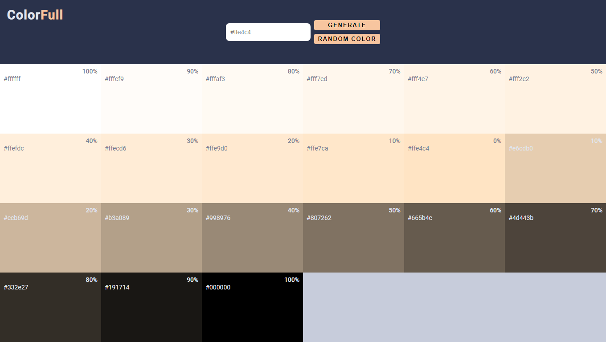

# ColorFull

## 💻 Project
A simple application to generate color shades.

## 🧪 Technologies
- [React](https://reactjs.org)
- [TypeScript](https://www.typescriptlang.org/)

## 📝 License
This project lives under MIT License. See [LICENSE](LICENSE.md) for more details.
